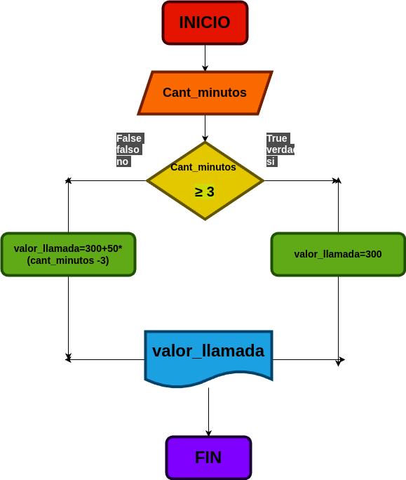

# Condicionales_1
condicionales n1

## Costo de una llamada telefonica

Ingresar el tiempo de duracion de una llamada telefonica y determinar la cantidad a apagar, de acuerdo con lo sguiente:

- Toda llamada que dure 3 minutos o menos tiene un costo de 300 pesos.
- Cada minuto adicional seria de 50 pesos.

## Input

cant_minutos: Se ingresa la cantidad de minutos de duracion de la llamada

### Variables de entrada
Cant_minutos: Cantidad de minutos que duro la llamada

### Prosesing
Valor_llamada: Calcular el valor  final de la llamada

Si es menor o igual a 3 minutos: Elvalor final sera de 300 pesos

Si es mayor a 3 minutos: Se adicionara 50 pesos

### Output
Valor_llamada
# Diseño

# Construccion